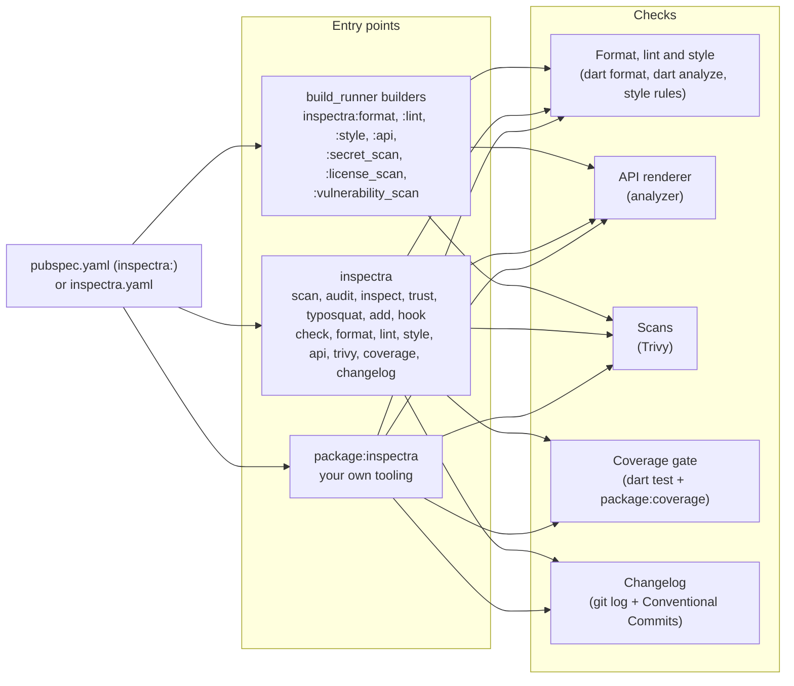
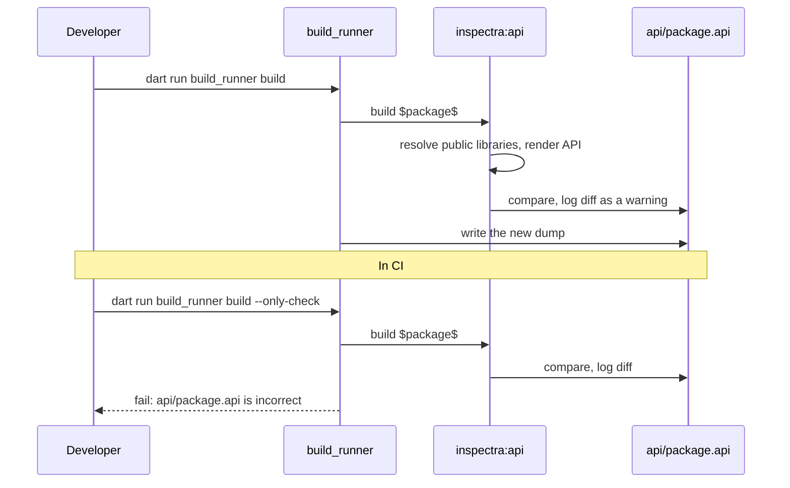
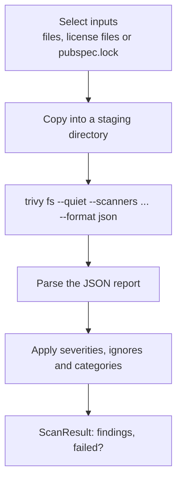

# How it works

<primary-label ref="guide"/>
<secondary-label ref="since-1-0"/>

<show-structure for="chapter" depth="2"/>

<link-summary>The builders, the command line, the configuration and Trivy, and how data flows between them.</link-summary>

<card-summary>The architecture behind every check, with the reasons for each design decision.</card-summary>

%product% has three entry points that share one configuration and one implementation of each check.

## The configuration

One configuration describes every feature. It is parsed once per build step or command, strictly: unknown keys and
wrong types are errors with the full key path. Where it lives, and why `pubspec.yaml` is the better place for
`build_runner`, is covered in [Where the configuration lives](Configuration-Overview.md).

## The builders

Adding %product% as a dev dependency applies six builders to your root package. They are declared in %product%'s
`build.yaml` with `auto_apply: root_package`, so dependencies of your package are never scanned or dumped.

| Builder | Input | Output | Written to |
|:--|:--|:--|:--|
| `inspectra:format` | `$package$` | `inspectra/format.json` | The artifact tree |
| `inspectra:lint` | `$package$` | `inspectra/lint.json` | The artifact tree |
| `inspectra:style` | `$package$` | `inspectra/style.json` | The artifact tree |
| `inspectra:api` | `$package$` | `api/<package>.api` | The package (`build_to: source`) |
| `inspectra:secret_scan` | `$package$` | `inspectra/trivy/secret.json` | The <tooltip term="artifact tree">artifact tree</tooltip> |
| `inspectra:license_scan` | `$package$` | `inspectra/trivy/license.json` | The artifact tree |
| `inspectra:vulnerability_scan` | `$package$` | `inspectra/trivy/vulnerability.json` | The artifact tree |

Every builder uses the synthetic `$package$` input, which exists once per package, so each runs once per build. The
format, lint and style builders also declare `.dart` as a required input, which makes `build_runner` run them after every
builder that generates Dart code - they check the package as the build leaves it.

### Why reruns are exact

`build_runner` reruns a build step only when an asset it read changed. %product%'s builders read everything they
depend on through the build step:

- the configuration, from `pubspec.yaml` (and `inspectra.yaml` when it is a build source),
- for the API dump, every library under `lib/` through the analyzer resolver, including everything those libraries
  import,
- for the secret scan, each file it scans, plus `trivy-secret.yaml` when that is a build source,
- for the license and vulnerability scans, `pubspec.lock`,
- for the format and lint checks, every Dart file they check, plus `analysis_options.yaml` when that is a build
  source,
- for the style check, every file it checks, the license header template and the custom rule files.

A build that changed none of these is a no-op for %product%: no analyzer run, no Trivy process. Files that are not
build sources are the exception; [Build sources](Build-Sources.md) explains which those are and how to add them.

### The API dump and `--only-check`

The API builder is the only one with `build_to: source`: its output is a file in your repository. That is what makes
the check idiomatic:

`--only-check` is a `build_runner` feature: it builds, writes nothing, and fails if any output in the
<tooltip term="package path">package path</tooltip> differs from the file on disk. %product% adds the diff to the log
so you see what changed, not only that something did.

## The command line

`dart run inspectra` reads the configuration from disk and runs the same checks as the builders, directly on the file
system:

- It sees every file, not only build sources, so the secret scan covers dotfiles and root-level configuration.
- It always runs: no caching, which is what a CI job wants.
- It runs the checks the builders cannot: the filesystem scan, the coverage gate and the changelog check.
- It applies fixes: `format --fix` and `lint --fix`.
- `check` runs everything enabled in a fixed order: format, lint, style, API, changelog, Trivy scans, coverage.
- `changelog generate` and `changelog notes` write the changelog of the next release from the Git history and
  print the release notes of a version.
- It runs the supply-chain commands - `scan` (the default), `audit`, `inspect`, `trust`, `typosquat`, `add` and
  `hook` - which have no builders.

The API commands render the API with the analyzer's `AnalysisContextCollection` instead of the build resolver. The
renderer is the same, so the dump is byte for byte what the builder writes - which is why `api check` from the command
line and `--only-check` agree.

## Trivy

The command line provisions Trivy before it runs: the configured executable, else an installed Trivy, else a cached
download, else a pinned, checksum-verified download - see [Installing Trivy](Trivy-Installation.md#provisioning). The
builders use an installed Trivy only.

Every scan runs `trivy fs` with `--format json` and reads the report. %product% never parses Trivy's console output,
and treats any non-zero exit code as a failure of Trivy itself rather than as findings: findings are decided from the
report.

The <tooltip term="staging directory">staging directory</tooltip> is why the scans are precise:

- The secret scan copies exactly the files matched by `include` and not by `exclude`, under their package-relative
  paths, and scans them in one Trivy run. Findings are reported with the same relative paths.
- The license scan copies the license files of the dependencies it checks, one directory per package, so each
  classified license maps back to its package.
- The vulnerability scan writes the `pubspec.lock` to scan - narrowed to shipped dependencies when configured - and
  scans only that.

The filesystem scan is the exception: it scans the package root in place, because its purpose is to see everything.

Trivy runs with the package root as its working directory, so `trivy.yaml`, `.trivyignore` and `trivy-secret.yaml`
there apply. See [Installing Trivy](Trivy-Installation.md#working-directory).

## The coverage gate

The gate runs the test runner as a child process with its output passed through, then works on the files the runner
wrote:

1. `dart test --coverage=coverage/raw` writes one JSON hit map per test suite; `flutter test --coverage` writes lcov.
2. `package:coverage` merges the hit maps and drops lines marked with `// coverage:ignore-…` comments.
3. Files outside `report_on` or matching `exclude` are dropped.
4. `coverage/lcov.info` is written, the table printed, and the total compared with `min_line_coverage`.

[Coverage](Coverage-Overview.md) covers each step in detail.

## Failure handling

| Situation | Builder | Command line |
|:--|:--|:--|
| A check fails | `SEVERE` log, the build fails | Exit code `1` |
| Findings that do not fail | `WARNING` log, the build passes | Listed as *(not failing)*, exit `0` |
| Broken configuration | `SEVERE` log with the key path | Exit code `65` with the key path |
| Package not resolved | `SEVERE` log: run `dart pub get` | Exit code `65`: run `dart pub get` |
| Trivy missing or crashing | `SEVERE` log with the reason | Exit code `69` with the reason |
| A `dart` tool or the test run failing | `SEVERE` log with the reason | Exit code `69` with the reason |

The command line follows the `sysexits` convention; see [Exit codes](CLI-Reference.md#exit-codes).

<seealso>
    <category ref="start">
        <a href="Overview.md">Overview</a>
        <a href="Getting-Started.md">Getting started</a>
    </category>
    <category ref="reference">
        <a href="Builder-Reference.md">Builder reference</a>
        <a href="CLI-Reference.md">Command line reference</a>
    </category>
    <category ref="config">
        <a href="Build-Sources.md">Build sources</a>
    </category>
</seealso>
