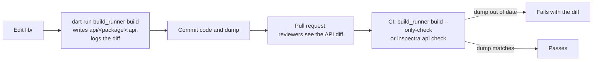

# Workflow

<primary-label ref="builder"/>
<secondary-label ref="opt-in"/>

<show-structure for="chapter,procedure" depth="2"/>

<link-summary>Recording, reviewing and checking the API dump, locally and in CI.</link-summary>

<card-summary>build_runner keeps the dump current; --only-check keeps CI honest.</card-summary>

The dump has three moments in its life: it is written while you develop, reviewed in a pull request, and checked in
CI. %product% supports each of them with `build_runner` and with its own command line.



## While developing

Run `build_runner` as usual:

```bash
dart run build_runner build      # once
dart run build_runner watch      # continuously
```

The `inspectra:api` builder resolves your public libraries and writes `api/<package>.api`. It reruns whenever a file
those libraries depend on changes - a file under `lib/`, or `pubspec.yaml` - and is a no-op otherwise.

When the result differs from the file on disk, the build logs a warning with the diff, then writes the new dump:

```text
W inspectra:api on $package$:
  The public API changed; review and commit api/shapes.api:
  @@ -26,5 +26,5 @@
  ...
```

The first time, it logs `Recording the public API in api/<package>.api for the first time.` instead, at info level, which `build_runner` shows with `--verbose`.

<tip>
The warning is the moment to decide: did you mean to change the API? If not, the diff tells you exactly which
declaration leaked or changed shape.
</tip>

### Without build_runner

```bash
dart run inspectra api dump
```

```text
Wrote the public API to api/shapes.api.
```

The command renders with the analyzer directly and writes the same file. Use it in packages that do not use
`build_runner` otherwise, or in scripts.

## Reviewing

Commit the dump together with the code that changed it. In the pull request, `api/<package>.api` is a small, sorted
file whose diff contains nothing but API changes - the place for a reviewer to ask *is this intended, and which
version does it need?* See [Which changes break consumers](API-Overview.md#which-changes-break-consumers).

<tip>
Make the dump reviewed by the right people with a <code>CODEOWNERS</code> entry:
<code>/api/ @your-org/api-owners</code>.
</tip>

## Checking in CI

<tabs group="check">
    <tab title="build_runner" group-key="build">
        <code-block lang="bash"><![CDATA[
dart run build_runner build --only-check
]]></code-block>
        <p><tooltip term="only-check">--only-check</tooltip> builds everything, writes nothing, and fails if any
            output in the package - the dump, and any other generated file - differs from the file on disk. It also
            catches stale <code>.g.dart</code> files of other builders, so it is the one check for "is everything
            generated committed".</p>
    </tab>
    <tab title="Command line" group-key="cli">
        <code-block lang="bash"><![CDATA[
dart run inspectra api check
]]></code-block>
        <p>Compares the rendered API with the committed dump and exits with <code>1</code> when they differ or
            when there is no dump. <code>dart run %package% check</code> includes it.</p>
    </tab>
</tabs>

### What a failed check prints

<tabs group="check">
    <tab title="build_runner" group-key="build">
        <code-block lang="text"><![CDATA[
W inspectra:api on $package$:
  The public API changed; review and commit api/shapes.api:
  @@ -26,5 +26,5 @@
     bool operator ==(Object other);
     int compareTo(Shape other);
  -  abstract Shape scale(double factor);
  +  abstract Shape scale(double factor, {bool keepLabel = true});
     @Deprecated double surface();
   }
E Verify failed due to Incorrect|Missing|Unexpected:

  I api/shapes.api
  Failed to build with build_runner/aot in 43s; wrote 3 outputs.
]]></code-block>
        <p>The <code>I</code> marks the dump as <i>incorrect</i>.</p>
    </tab>
    <tab title="Command line" group-key="cli">
        <code-block lang="text"><![CDATA[
The public API changed.

@@ -26,5 +26,5 @@
   bool operator ==(Object other);
   int compareTo(Shape other);
-  abstract Shape scale(double factor);
+  abstract Shape scale(double factor, {bool keepLabel = true});
   @Deprecated double surface();
 }

If the change is intended, record it and commit the result:

    dart run inspectra api dump
]]></code-block>
    </tab>
</tabs>

When no dump has been recorded yet, `api check` fails with:

```text
No public API dump has been recorded yet at api/shapes.api.

Create it and commit the result:

    dart run inspectra api dump
```

## Fixing a failed check

<procedure title="When the check fails" id="fix-check">
    <step>
        <p>Read the diff. Decide whether the change is intended.</p>
    </step>
    <step>
        <p><b>Intended</b>: record it with <code>dart run build_runner build</code> or
            <code>dart run %package% api dump</code>, commit the dump, and choose the version accordingly.</p>
    </step>
    <step>
        <p><b>Not intended</b>: undo it in the code - move the declaration to <code>lib/src</code>, make it private,
            restore the signature, or annotate it with <code>@internal</code>.</p>
    </step>
    <step>
        <p>Run the check again.</p>
    </step>
</procedure>

## Line endings

The comparison ignores the difference between `\n` and `\r\n`, so a dump checked out with `core.autocrlf=true` on
Windows does not fail the command-line check. `build_runner --only-check` compares bytes; add
`api/*.api text eol=lf` to `.gitattributes` to keep the file identical on every platform.

<seealso>
    <category ref="api">
        <a href="API-Overview.md">Public API validation</a>
        <a href="API-Diff.md">Reading the diff</a>
        <a href="API-Configuration.md">Configuration</a>
    </category>
    <category ref="operations">
        <a href="CI-Integration.md">CI integration</a>
    </category>
</seealso>
