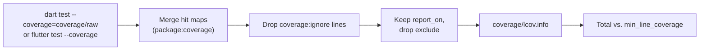

# Coverage

<primary-label ref="cli"/>
<secondary-label ref="cli-only"/>
<secondary-label ref="opt-in"/>
<secondary-label ref="no-network"/>

<show-structure for="chapter" depth="2"/>

<link-summary>Running the tests with coverage, writing lcov.info, and failing below a threshold.</link-summary>

<card-summary>A coverage gate built on dart test and package:coverage, with no threshold until you set one.</card-summary>

<tldr>
<p><b>Enable</b>: <code>coverage: { enabled: true, min_line_coverage: 80 }</code></p>
<p><b>Command</b>: <code>dart run %package% coverage</code>, or <code>check</code></p>
<p><b>Writes</b>: <code>coverage/lcov.info</code></p>
<p><b>Library</b>: <code>package:coverage</code> %coverage_version%</p>
</tldr>

The coverage gate runs your tests with coverage enabled, turns the result into an
<tooltip term="lcov">lcov</tooltip> report and compares the line coverage with a threshold. It replaces the usual
sequence of `dart test --coverage`, `format_coverage` and a script that parses the total.

## Quick start

<procedure title="Measure, then gate" id="measure-then-gate">
    <step>
        <p>Measure without a threshold:</p>
        <code-block lang="bash"><![CDATA[
dart run inspectra coverage
]]></code-block>
    </step>
    <step>
        <p>Read the result:</p>
        <code-block lang="text"><![CDATA[
  lib/fixture.dart    25.00%  (1/4)
  lib/src/calc.dart   40.00%  (2/5)
  Total               33.33%  (3/9)

  1 file(s) were not loaded by any test and are not counted:
    lib/src/unused.dart

  Report: coverage/lcov.info
]]></code-block>
    </step>
    <step>
        <p>Set a threshold you meet today, and raise it as coverage improves:</p>
        <code-block lang="yaml"><![CDATA[
inspectra:
  coverage:
    enabled: true
    min_line_coverage: 30
]]></code-block>
    </step>
</procedure>

## How it works



1. **Run the tests.** `dart test --coverage=<output>/raw` runs your test suite in the VM and writes one JSON
   <tooltip term="hit map">hit map</tooltip> per test file. The tests' output is shown as usual. `coverage/raw` is
   emptied first, so results of earlier runs never leak in.
2. **Merge.** `package:coverage` reads every hit map and merges the counts per line across test files.
3. **Honour ignore comments.** Lines marked with `// coverage:ignore-line`, blocks between
   `// coverage:ignore-start` and `// coverage:ignore-end`, and files with `// coverage:ignore-file` are dropped. See
   [Ignoring code](Coverage-Ignoring-Code.md).
4. **Filter.** Only files below a `report_on` directory are kept, minus files matching an `exclude` glob.
5. **Write lcov.** `coverage/lcov.info`, with paths relative to the package root.
6. **Gate.** The total line coverage is compared with `min_line_coverage`.

For Flutter packages, step 1 runs `flutter test --coverage` instead. See [Flutter](Coverage-Flutter.md).

## Line coverage

Line coverage is the share of *executable* lines that ran at least once. The VM decides which lines are executable:
declarations, signatures, comments and blank lines are not counted, statements and expressions are.

```text
line coverage = executable lines hit / executable lines × 100
```

The total is computed over all lines of all reported files, not as an average of the files' percentages, so a large
file weighs more than a small one.

## Files no test loaded

The VM only reports coverage for libraries that a test imported, directly or indirectly. A file no test reaches would
simply be missing from the report - and the total would look better than it is. %product% lists such files
separately:

```text
  1 file(s) were not loaded by any test and are not counted:
    lib/src/unused.dart
```

They are files below `report_on` that are not excluded, contain at least one declaration and are not `part` files.
Libraries consisting only of `export` directives are skipped, since they have no executable lines anyway.

<tip>
To have them counted, import them from a test. A test that only imports every library is enough to make their
untested lines show up as 0% instead of being invisible.
</tip>

## When it runs

| Command | Runs the gate |
|:--|:--|
| `dart run %package% coverage` | Always, whether `coverage.enabled` is set or not |
| `dart run %package% coverage --min 85` | Always, with 85% instead of `min_line_coverage` |
| `dart run %package% check` | Only when `coverage.enabled` is `true` |
| `dart run build_runner build` | Never - running a test suite is not a build step |

## Outcomes

| Situation | Exit code | Output |
|:--|:--|:--|
| No threshold set | `0` | The table, without a verdict |
| At or above the threshold | `0` | `Line coverage 91.30% meets the required 85.00%.` |
| Below the threshold | `1` | `Line coverage 33.33% is below the required 90.00%.` |
| A test failed | `2` | `"dart test --coverage=…" failed with exit code 1; see its output above.` |
| The runner could not start | `2` | `Could not start "flutter": …` |

A failing test is an error, not a low coverage: coverage of a broken test suite means nothing.

<seealso>
    <category ref="coverage">
        <a href="Coverage-Configuration.md">Configuration</a>
        <a href="Coverage-Reports.md">Reports</a>
        <a href="Coverage-Ignoring-Code.md">Ignoring code</a>
        <a href="Coverage-Flutter.md">Flutter</a>
    </category>
    <category ref="external">
        <a href="https://pub.dev/packages/coverage">package:coverage</a>
    </category>
</seealso>
