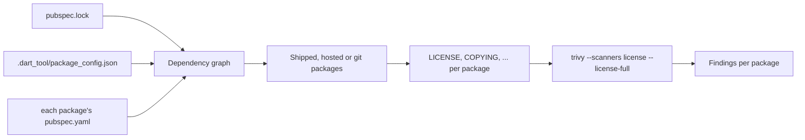

# License scan

<primary-label ref="builder"/>
<secondary-label ref="requires-trivy"/>
<secondary-label ref="no-network"/>
<secondary-label ref="opt-in"/>

<show-structure for="chapter" depth="2"/>

<link-summary>Checking the licenses of the dependencies you ship against Trivy's license categories.</link-summary>

<card-summary>Forbidden, restricted and unclassifiable licenses of shipped dependencies, found before release.</card-summary>

<tldr>
<p><b>Enable</b>: <code>trivy: { enabled: true }</code> - the license scan is on with it</p>
<p><b>Command</b>: <code>dart run %package% trivy license</code></p>
<p><b>On build</b>: <code>trivy.license.run_on_build: true</code></p>
<p><b>Reports by default</b>: forbidden, restricted and unknown licenses of shipped dependencies</p>
</tldr>

A license binds what you distribute. A package that depends on a GPL library, directly or five levels down, may owe
its users the source code of everything linked with it; an AGPL dependency extends that to network use. The license
scan finds such dependencies before a release does.

## Why it does not just read pubspec.lock

Trivy reads `pubspec.lock` natively, but a pub lock file holds names, versions and sources - no license information.
Scanning it for licenses finds nothing. %product% therefore goes to the packages themselves:

1. It builds the dependency graph of your package from `pubspec.lock`, `.dart_tool/package_config.json` and the
   `pubspec.yaml` of every resolved package.
2. It selects the packages to check: those reachable from your `dependencies`, from pub.dev or git.
3. It copies each selected package's license files into a <tooltip term="staging directory">staging
   directory</tooltip>, one directory per package.
4. One Trivy run classifies all of them: `trivy fs --scanners license --license-full`.
5. Each classified license becomes a finding for its package; packages without a license file, or with one Trivy cannot
   classify, become `UNKNOWN` findings.



## Which packages are checked

<deflist type="medium">
    <def title="Shipped dependencies only, by default">
        The scan follows <code>dependencies</code> of your <code>pubspec.yaml</code>, then the
        <code>dependencies</code> of each of those, and so on. Packages reachable only through your
        <code>dev_dependencies</code> - test frameworks, build_runner, linters - are not checked, because they never
        reach a consumer. Set <code>include_dev_dependencies: true</code> to check them too. A package's own
        <code>dev_dependencies</code> are never followed; pub does not resolve them either.
    </def>
    <def title="From pub.dev or git">
        Packages with <code>source: hosted</code> or <code>source: git</code> in <code>pubspec.lock</code>. Path
        dependencies are your own code, typically other packages of the same repository, and SDK packages such as
        <code>flutter</code> belong to the toolchain.
    </def>
    <def title="Not listed in ignored_packages">
        A package named there is skipped entirely.
    </def>
</deflist>

<note>
This is why the graph is built from every package's <code>pubspec.yaml</code>: the lock file marks every indirect
dependency as <code>transitive</code>, whether a shipped package or a dev tool pulled it in.
</note>

## Which files are license files

Files directly in the package directory whose name, case-insensitively, is `LICENSE`, `LICENCE`, `COPYING` or
`UNLICENSE`, optionally followed by an extension or a suffix: `LICENSE.md`, `LICENSE.txt`, `LICENSE-MIT`,
`COPYING.LESSER`. A package with several license files - common for dual-licensed packages - produces one finding per
license Trivy recognizes.

## Configuration

```yaml
inspectra:
  trivy:
    enabled: true
    license:
      enabled: true                   # default
      run_on_build: false             # default
      fail_on_findings: true          # default
      severity: [CRITICAL, HIGH, UNKNOWN]
      ignored_licenses: []            # SPDX identifiers, e.g. [LGPL-3.0]
      ignored_packages: []            # package names
      include_dev_dependencies: false # default
```

| Key | Default | Description |
|:--|:--|:--|
| `enabled` | `true` | Whether the scan runs when `trivy.enabled` is set. |
| `run_on_build` | `false` | Whether `build_runner build` runs it. It reruns only when `pubspec.lock` changes. |
| `fail_on_findings` | `true` | Whether a finding fails the build or the command. |
| `severity` | `[CRITICAL, HIGH, UNKNOWN]` | Which license severities are reported. |
| `ignored_licenses` | `[]` | <tooltip term="SPDX identifier">SPDX identifiers</tooltip> never reported, case-insensitive. |
| `ignored_packages` | `[]` | Packages never checked. |
| `include_dev_dependencies` | `false` | Whether dev-only packages are checked. |

## License categories and severities

Trivy sorts every license it recognizes into a <tooltip term="license category">category</tooltip> and gives the
category a severity:

| Category | Severity | Typical licenses | Meaning |
|:--|:--|:--|:--|
| forbidden | `CRITICAL` | AGPL-3.0, CC-BY-NC-* | Usually not acceptable in distributed software |
| restricted | `HIGH` | GPL-2.0, GPL-3.0, LGPL-2.1, LGPL-3.0 | Obligations on the code it is combined with |
| reciprocal | `MEDIUM` | MPL-2.0, EPL-2.0, CDDL-1.0 | Obligations on modifications of the licensed files |
| notice | `LOW` | MIT, BSD-2-Clause, BSD-3-Clause, Apache-2.0 | Attribution required |
| permissive | `LOW` | | Few obligations |
| unencumbered | `LOW` | CC0-1.0, Unlicense, 0BSD | Public domain or equivalent |
| *(not recognized)* | `UNKNOWN` | | Reported by %product% as `unclassified` |

The default `severity` reports forbidden, restricted and unknown licenses. Most of pub.dev is BSD, MIT or Apache and
produces no finding.

### Changing the categories

Trivy reads its category lists from `trivy.yaml`, and %product% runs Trivy in the package root, so a `trivy.yaml`
there changes how licenses are classified:

```yaml
# trivy.yaml, next to pubspec.yaml
license:
  forbidden:
    - AGPL-3.0
    - GPL-3.0
  restricted:
    - LGPL-3.0
  notice:
    - MIT
    - BSD-3-Clause
    - Apache-2.0
```

A license listed under `forbidden` is then reported as `CRITICAL` with the category `forbidden`.

## Findings

```text
Trivy license scan: 3 finding(s).
  [CRITICAL] some_agpl_package 2.1.0: AGPL-3.0 - license category "forbidden"
  [UNKNOWN] private_fork 1.0.0: unclassified - Trivy could not classify the license file
  [UNKNOWN] bare_package 0.3.0: no-license-file - package ships no license file
```

| ID | Severity | Meaning | What to do |
|:--|:--|:--|:--|
| an SPDX identifier | from its category | Trivy recognized the license | Replace the dependency, get approval, or add it to `ignored_licenses` |
| `unclassified` | `UNKNOWN` | A license file exists, but Trivy could not match it to a known license | Read it; then add the package to `ignored_packages` if acceptable |
| `no-license-file` | `UNKNOWN` | The package ships no license file | Without a license you have no right to use it; ask the author |
| `no-license-file`, *not resolved locally* | `UNKNOWN` | The package is in the lock file but not in the pub cache | Run `dart pub get` |

## Ignoring licenses and packages

```yaml
inspectra:
  trivy:
    license:
      ignored_licenses: [LGPL-3.0]       # accepted after legal review
      ignored_packages: [private_fork]   # internal package with a custom license
```

`ignored_licenses` drops findings of that license for every package; `ignored_packages` skips the package entirely,
including the `UNKNOWN` findings. A package whose only license is ignored produces no finding.

## Running it

```bash
dart run inspectra trivy license
```

On build, set `run_on_build: true`. The builder reads `pubspec.lock` through `build_runner`, so it reruns when
dependencies change and costs nothing otherwise.

<include from="lib.topic" element-id="trivy-required"/>

<seealso>
    <category ref="security">
        <a href="Trivy-Severities.md#licenses">License severities</a>
        <a href="Trivy-Vulnerability-Scan.md">Vulnerability scan</a>
        <a href="Trivy-Installation.md#working-directory">Working directory</a>
    </category>
    <category ref="config">
        <a href="Configuration-Reference.md#trivy-license">Configuration reference</a>
    </category>
    <category ref="external">
        <a href="%trivy_docs%/scanner/license/">Trivy license scanning</a>
        <a href="https://spdx.org/licenses/">SPDX license list</a>
    </category>
</seealso>
